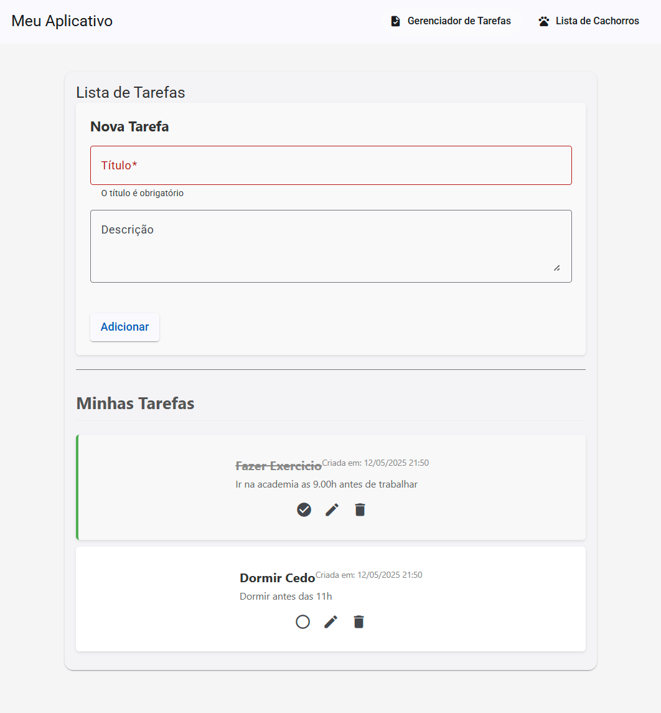
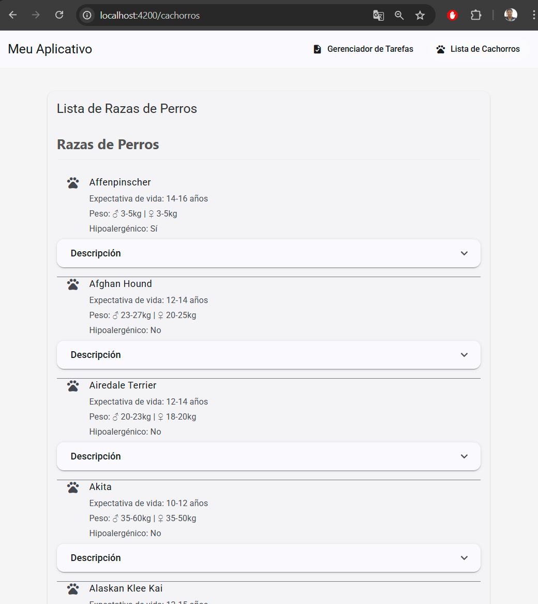

# Gerenciador de Tarefas e Lista de Cachorros




## Resumo
Aplicativo que permite gerenciar tarefas (criar, editar e remover) e visualizar uma lista de raças de cachorros obtida através de uma API externa.

## Funcionalidades
- Gerenciamento completo de tarefas
- Visualização de raças de cachorros
- Interface com Material Design
- Navegação entre diferentes seções

## Tecnologias
- Angular 19
- Angular Material
- RxJS
- TypeScript

## Instalação
```
npm install
```